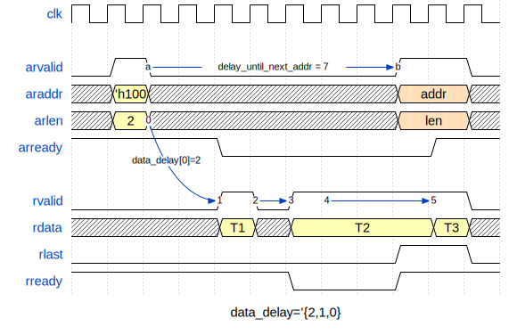
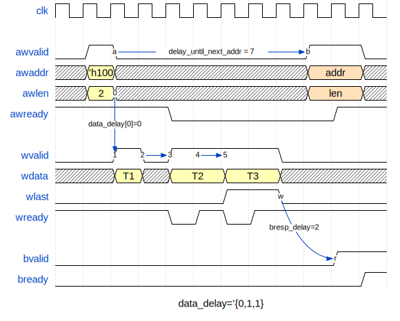
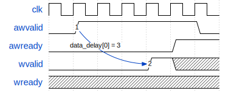
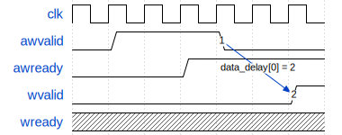
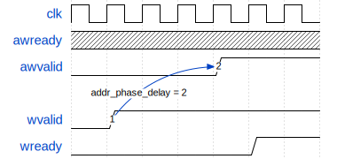

# OVIP AXI

UVM verification IP for the AXI family of protocols — **AXI3, AXI4, AXI4-Lite**. Each agent is switchable between active master, active slave, and passive monitor. The monitor performs X/Z and signal-stability protocol checks on every channel by default. A sequence library covers single/multi-beat bursts, out-of-order and interleaved traffic, and a memory-backed slave responder. Apache-2.0 licensed; portable across Modelsim/Questa, VCS, and Xcelium.

### At a glance

| Area | Status |
|---|---|
| Protocols | AXI3, AXI4, AXI4-Lite. ACE / ACE-Lite enum values exist but the protocol is **not** implemented |
| Burst types | INCR, FIXED, WRAP |
| Bus widths | 1B – 512B (≥256B is out-of-spec and requires `size_width = 4`) |
| Out-of-order completion | Yes (`*_out_of_order_depth`), with five scheduling algorithms |
| AXI3 W-channel interleaving | Yes (`wr_interleave_depth`) |
| Byte-lane alignment | Auto (default) or manual. Covers narrow transfers, unaligned starts, INCR, and FIXED |
| Mid-test reset | Drivers, monitor, and base slave sequence all recover cleanly |
| Functional coverage | No covergroups ship today |
| UVM callbacks / transaction recording | Not wired up |

Full known-limitations list lives in [CHANGELOG.md](CHANGELOG.md); wanted-features and good first contributions are in [CONTRIBUTING.md](CONTRIBUTING.md).

## Integrating into your environment

The VIP ships a single compile filelist, [`ovip_axi.f`](ovip_axi.f). Add it to your simulator command and you're done:

```sh
# 1) Tell the filelist where this repo is.
export OVIP_ROOT=/path/to/ovip

# 2) Add ovip_axi.f to your existing compile step.
```

| Simulator | Command |
|---|---|
| Modelsim/Questa | `vlog -sv -mfcu -f $OVIP_ROOT/verif/ovip_axi/ovip_axi.f` |
| VCS             | `vcs -sverilog -ntb_opts uvm-1.2 -f $OVIP_ROOT/verif/ovip_axi/ovip_axi.f` |
| Xcelium         | `xrun -uvm -uvmhome CDNS-1.2 -sv -f $OVIP_ROOT/verif/ovip_axi/ovip_axi.f` |

The filelist relies on the `OVIP_ROOT` environment variable; nothing else needs to be configured. UVM 1.2 comes from your simulator's built-in library (no source needed). Apply any [Compile-Time Defines](#compile-time-defines) below as additional `+define+...` arguments on the same compile line.

For a minimal end-to-end example you can run as-is, see [`examples/ovip_axi/01_minimal_loopback/`](../../examples/ovip_axi/01_minimal_loopback/).

## Compile-Time Defines

All defines below are passed to the simulator at compile time via `+define+NAME=VALUE` (or just `+define+NAME` for flag-style switches). The VIP supplies sensible defaults in `src/ovip_axi_defines.sv` (guarded by `` `ifndef ``), so you only need to set a define when you want to override it.

### Signal-Width Limits

Each value sets the *physical wire width* of a channel signal in the interface. The agent's runtime `cfg.*_width` fields select how many of those bits are actually active per agent; values above the limit are rejected by `check_config`. Bumping a limit costs sim memory but unlocks larger runtime widths.

| Define | Default | Used for |
|---|---|---|
| `OVIP_AXI_MAX_ID_WIDTH` | `16` | `awid`/`wid`/`bid`/`arid`/`rid` wire width |
| `OVIP_AXI_MAX_ADDR_WIDTH` | `64` | `awaddr`/`araddr` wire width |
| `OVIP_AXI_MAX_USER_WIDTH` | `32` | `awuser`/`wuser`/`buser`/`aruser`/`ruser` wire width |
| `OVIP_AXI_MAX_DATA_WIDTH` | `128*8` (= 1024) | `wdata`/`rdata` wire width. Must be ≥ `bus_width*8` of any agent. Set to `2048` or `4096` for out-of-spec wide buses |
| `OVIP_AXI_MAX_STRB_WIDTH` | `OVIP_AXI_MAX_DATA_WIDTH/8` | `wstrb` wire width. Derived from `OVIP_AXI_MAX_DATA_WIDTH`; override only if you want a non-default ratio |

### Feature Switches

| Define | Default | Effect |
|---|---|---|
| `OVIP_AXI_DISABLE_XZ_AND_SIGNALS_STABILITY_CHECKS` | undefined (checks ON) | Define to opt out of the monitor's X/Z assertions and signal-stability checks. The checks are on by default because the protocol violations they catch (X's on a sampled signal, `*valid` deasserted before `*ready`, AxLEN changing mid-handshake, ...) are almost always real bugs. Disable only for early DUT bringup or when the simulation cost is unacceptable. |
| `OVIP_AXI_INCLUDE_USER_DEFINES` | undefined (off) | When defined, the VIP `` `include ``s `ovip_axi_user_defines.sv` from your include path, so you can stash project-local defines/macros without touching the VIP. |

### Randomization Limits

Soft upper bounds applied to the **delay** fields of `ovip_axi_trans` so a bare `tr.randomize()` doesn't generate huge timing gaps out of the box. None of these are spec-mandated maximums — they exist purely to make the default random distribution comfortable. Because the underlying constraints are `soft`, a per-call `with { ... }` clause silently overrides them; to change the default globally, redefine the macro at compile time.

| Define | Default | Bounds |
|---|---|---|
| `OVIP_AXI_TRANS_RD_DATA_DELAY_MAX` | `30` | Each entry of `data_delay[$]` when `tr_type == READ` (slave-side per-beat read data delay). |
| `OVIP_AXI_TRANS_WR_DATA_DELAY_MAX` | `30` | Each entry of `data_delay[$]` when `tr_type == WRITE` (master-side per-beat write data delay). |
| `OVIP_AXI_TRANS_WR_RESP_DELAY_MAX` | `30` | `bresp_delay` (slave-side BRESP timing). |
| `OVIP_AXI_TRANS_ADDR_PHASE_DELAY_MAX` | `30` | `addr_phase_delay` (master-side gap when `data_start_event == BEFORE_ADDR`). |
| `OVIP_AXI_TRANS_NEXT_ADDR_DELAY_MAX` | `30` | `delay_until_next_addr` (master-side pacing between consecutive address phases). |
| `OVIP_AXI_TRANS_NEXT_DATA_DELAY_MAX` | `30` | `delay_until_next_data` (master-side pacing between consecutive data phases). |

`len`, `size`, and `addr` are intentionally **not** capped — users normally pin them to their test's needs anyway. Override per call:

```systemverilog
tr.randomize() with { addr inside {[32'h1000_0000 : 32'h1000_0FFF]}; len < 4; };
```

or globally:

```
+define+OVIP_AXI_TRANS_RD_DATA_DELAY_MAX=100 +define+OVIP_AXI_TRANS_WR_RESP_DELAY_MAX=5
```

### Notes on Wide Buses (Out of Spec)

`OVIP_AXI_BUS_WIDTH_256B` and `OVIP_AXI_BUS_WIDTH_512B` require AxSIZE > `3'b111`, which violates the AXI spec. To use them:

- Set `OVIP_AXI_MAX_DATA_WIDTH ≥ bus_width*8` (e.g., `4096` for 512B buses).
- Leave `size_width` at its default `3`: `check_config` auto-bumps it to `4` (with a UVM_INFO) whenever `bus_width > 128B`. The `awsize`/`arsize` wires are 4 bits wide so spec-compliant agents (size ≤ 7) are unaffected.


## Basic Timings

### Read Transaction Timing

Read transaction timing is fairly simple. On the master driver side, there is only `delay_until_next_addr`, which indicates the number of cycles after sampling (`arvalid & arready`) to hold the address channel before sending a new read request. On the driver side, there is an array called `data_delay` which stores the delay in cycles between data beats. The first element stores the delay between the request and the first data beat, and all other elements store the delays between each consecutive beat. Note that the delay is counted from the driving start time (`rvalid == 1`) and not from sampling (`rvalid & rready`). Additionally, one can use `delay_until_next_data` to delay any subsequent read response.

For example, in the following paragraph, `data_delay[0]` corresponds to the delay between points 0 and 1, `data_delay[1]` applies to points 2 and 3, and `data_delay[2]` is used for points 4 and 5. Note that for this specific `rready` behavior, changing `data_delay[2]` to 1, 2, or 3 won't change anything.



### Write Transaction Timings

From the slave driver's perspective, the only parameter to adjust is `bresp_delay`, which determines the delay between sampling the last beat and driving the response. On the master driver side, two primary variables control timing: `delay_until_next_addr`, which functions similarly to the AR channel, and `data_delay`, which resembles the read data channel with a distinct difference explained in the following section.



### Address & Data Channels Timing Dependency

The delay between the address phase and the first data beat can be controlled with these variables: `data_delay[0]`, `data_start_event`, and `addr_phase_delay`. `data_start_event` indicates the event which serves as the base point to set the delay. It can be set to three different values:

1. **DATA_START_EV_ADDR_DRIVEN**:
   When `data_start_event = DATA_START_EV_ADDR_DRIVEN`, `data_delay[0]` defines the delay between address phase driving and data phase driving. Setting it to 0, for example, will drive both the address and data in the same cycle.



2. **DATA_START_EV_ADDR_SAMPLED**:
   Similar to `DATA_START_EV_ADDR_DRIVEN`, but in this case, `data_delay[0]` is counted from address phase sampling (`awvalid & awready`).



3. **DATA_START_EV_BEFORE_ADDR**:
   When `data_start_event = DATA_START_EV_BEFORE_ADDR`, `addr_phase_delay` sets the delay between driving the first data beat and the address phase driving.



## Byte-Lane Alignment

In AXI, when a beat is narrower than the bus or the burst starts at an unaligned address, the active bytes have to be driven on the byte lanes that match the address — not at the LSB of `wdata`/`rdata`. For example, with an 8-byte bus, address `0x05` and a 1-byte beat, the byte must land on lane 5 (`wdata[47:40]`) and `wstrb[5]` must be set. For the next beat at address `0x06` (in an INCR burst), the byte moves to lane 6, and so on.

`cfg.auto_byte_lanes_alignment` (default `1`) decides who places the data on the correct lane:

- **`= 1` (default, recommended):** the user fills `tr.data_beats[i]` (and `tr.strb_beats[i]` for writes) **at bit 0**, as if the bus were lane-0-aligned. The driver shifts each beat into the correct byte lane before driving; the monitor shifts back when sampling, so the value the user sees in `tr.data_beats[i]` is always the natural, lane-0-aligned content. Strobes are derived from `tr.size` and the address — the user does not have to compute `wstrb` manually.
- **`= 0`:** the VIP drives `tr.data_beats[i]` straight onto `wdata`. The user is responsible for placing each beat in the right byte lane *and* setting `tr.strb_beats[i]` accordingly. Use this when your test fully controls the wire-level picture (e.g. checking that the VIP reacts correctly to a deliberately misaligned beat).

### Example

8B bus, INCR burst, address `0x5`, size = 1B (so each beat is 1 byte, narrow transfer), 4 beats of `0xA0, 0xA1, 0xA2, 0xA3`:

| | `auto_byte_lanes_alignment = 1` | `auto_byte_lanes_alignment = 0` |
|---|---|---|
| `tr.data_beats[0]` (user fills) | `64'h00000000000000A0` | `64'h0000A00000000000` |
| `tr.strb_beats[0]` (user fills) | *don't care* (VIP computes) | `8'b0010_0000` |
| `wdata` on the wire (beat 0) | `64'h0000A00000000000` | `64'h0000A00000000000` |
| `wstrb` on the wire (beat 0) | `8'b0010_0000` | `8'b0010_0000` |

The wire picture is identical — only who shifts the data differs.

### Burst-type coverage

INCR, FIXED, and WRAP are all supported under auto-alignment, including the corners — narrow transfers, unaligned start addresses, FIXED with `burst_size == bus_width` (covered by `ovip_axi_fixed_full_width_alignment_test`), and WRAP at all spec-legal lengths (covered by `ovip_axi_wrap_burst_test`). On a full-width transfer with an aligned address the lane offset is zero, so the master driver and slave/monitor sample the data unshifted — exactly what the user wrote in `data_beats[i]`. The monitor enforces WRAP's spec rules (length ∈ {2,4,8,16} and start address aligned to `burst_size`).

## Ready Patterns

The level driven on a `ready` signal (`awready`/`wready`/`arready` on the slave side, `rready`/`bready` on the master side) is controlled by a *ready pattern* (`ovip_axi_ready_pattern_t`), a small struct with two fields:

```systemverilog
typedef struct {
    int unsigned cycles[$]; // per-phase cycle counts
    bit          loop;      // 1 = repeat the cycles queue forever; 0 = play once and hold
} ovip_axi_ready_pattern_t;
```

Each element of `cycles` holds the current level for that many cycles, and the level alternates with the element index — **even indices drive `0`, odd indices drive `1`**.

```
cycles = '{3, 1, 4, 2}
           |  |  |  |
           |  |  |  +-- ready = 1 for 2 cycles
           |  |  +----- ready = 0 for 4 cycles
           |  +-------- ready = 1 for 1 cycle
           +----------- ready = 0 for 3 cycles
```

When the last element finishes, the `loop` flag decides what happens next:

- `loop = 0` (one-shot): the final level is held until a new pattern is delivered.
- `loop = 1` (repeating): driving wraps back to `cycles[0]` and continues forever.

```
One-shot  : '{cycles:'{3, 1, 4}, loop:0}  // 3 low, 1 high, 4 low, then held at 0
Repeating : '{cycles:'{3, 1},    loop:1}  // 3 low, 1 high, repeat
```

A common idiom is the always-ready pattern `'{cycles:'{0, 1}, loop:0}` — drive `0` for 0 cycles (no-op), then `1` and hold. This is what every channel's default config uses.

### Delivering a pattern to a driver

There are three ways to hand a ready pattern to a driver:

1. **Via the agent config (defaults).** Set `cfg.default_<chan>ready_pattern` (e.g. `default_arready_pattern`). Each driver starts up using its default until a new pattern arrives. The factory default for all five channels is the always-ready pattern shown above.

   ```systemverilog
   slave_cfg.default_awready_pattern = '{cycles:'{3, 1}, loop:1}; // 3 low, 1 high, repeat
   ```

2. **Via the transaction.** Set the matching `<chan>ready_pattern` field on a transaction (`tr.arready_pattern`, `tr.rready_pattern`, ...). When the driver processes that transaction, any pattern whose `cycles` queue is non-empty replaces the channel's current pattern; leave `cycles` empty (size 0) to keep the existing one.

   ```systemverilog
   tr.arready_pattern = '{cycles:'{5, 1}, loop:0}; // 5 low then held at 1, this transaction onward
   ```

3. **Directly via the driver helper.** Call `<driver>.put_<chan>ready_pattern(cycles, loop)`. The `loop` argument defaults to `0` (one-shot).

   ```systemverilog
   slave_driver.put_arready_pattern('{3, 1, 4});       // one-shot, ends held at ready = 0
   slave_driver.put_arready_pattern('{3, 1}, 1);       // repeating: 3 low, 1 high, repeat
   ```

Internally all three routes feed the same per-channel mailbox; pushing a new pattern preempts the one currently running and restarts driving from its first element.

## Out-of-Order, Interleaving & Scheduling

When out-of-order / interleaving depth is greater than 1, a driver can have several outstanding transactions whose next data beat (or write response) is ready to be driven in the same clock cycle. A per-channel scheduler decides, every cycle, which one of them to drive. It is configured with these `cfg` fields:

| Field | Meaning |
|---|---|
| `wr_out_of_order_depth` / `rd_out_of_order_depth` | How many outstanding transactions deep the scheduler may look (the reorder window). `1` = strictly in-order. |
| `wr_interleave_depth` / `rd_interleave_depth` | How many distinct IDs may have their data beats interleaved concurrently. `1` = no interleaving. |
| `wr_scheduling_alg` / `rd_scheduling_alg` | Which ready transaction to pick each cycle (see below). |

### Eligibility rules (applied before the algorithm)

Each cycle the scheduler first builds the **ready set** — the transactions eligible to advance this cycle — using these rules:

- **Reorder window:** only the first `*_out_of_order_depth` entries of the outstanding queue are considered.
- **Per-ID ordering:** AXI requires data for a given ID to stay in order, so at most one transaction per ID is eligible at a time — the oldest not-yet-complete one. Later transactions with the same ID wait their turn.
- **Per-beat readiness:** a transaction is only eligible once its programmed inter-beat delay has elapsed.
- **Interleave limit:** a *new* ID is only added to the in-flight set while fewer than `*_interleave_depth` IDs are currently interleaved.

### Scheduling algorithms (`ovip_axi_scheduling_algorithm_t`)

Given the ready set, the algorithm chooses which transaction to drive:

| Algorithm | Behavior |
|---|---|
| `OVIP_AXI_SCH_ALG_RANDOM` (default) | Uniformly random pick among the ready set. |
| `OVIP_AXI_SCH_ALG_ROUND_ROBIN` | Rotate forward through the ready set from cycle to cycle. |
| `OVIP_AXI_SCH_ALG_ROUND_ROBIN_REVERSED` | Rotate backward through the ready set. |
| `OVIP_AXI_SCH_ALG_ALWAYS_FIRST` | Always pick the oldest ready transaction. |
| `OVIP_AXI_SCH_ALG_ALWAYS_LAST` | Always pick the newest ready transaction. |

> Note: round-robin currently rotates over the *positions* in each cycle's ready set, which spreads selection but is not a strict per-ID fairness guarantee (the ready set is recomputed every cycle). See the VIP source `ovip_axi_out_of_order_queue.sv` for exact behavior.

### Outstanding-transaction limits

The monitor can enforce a limit on how many transactions are in flight at once,
via `cfg.num_outstanding_wr_transactions`, `cfg.num_outstanding_rd_transactions`,
and the combined `cfg.num_outstanding_transactions` (`0` = unlimited). Exceeding a
configured limit raises an `AXI_MON/OUTSTANDING_EXCEED` error.

A transaction counts as outstanding from **whichever phase appears first** until
its completion (BRESP for writes, last beat for reads). This matters for
data-before-address writes (`data_start_event == OVIP_AXI_DATA_START_EV_BEFORE_ADDR`):
such a write is counted as soon as its **data** phase opens it — not only once its
address arrives — so the limit reflects work that is genuinely in flight on the bus.

## Writing Sequences

This section is about writing your own master-side and slave-side sequences against the VIP. The two sides follow different conventions; both are important to internalize before extending the testbench.

### Master sequences (the get/put model)

The master driver uses UVM's **get/put** pattern, not the more common `get_next_item`/`item_done` pattern. The driver pulls an item off the sequencer via `seq_item_port.get(req)` (which auto-acknowledges the item — `start_item`/`finish_item` returns *here*), then later pushes the completed transaction back via `seq_item_port.put(rsp)` once the actual bus traffic for that transaction is done.

The consequence:

> ⚠️ **`start_item` / `finish_item` returns as soon as the driver has *accepted* the item, not when the bus transaction completes.** If you call `seq.start(...)` in `main_phase` and immediately drop the objection, the simulation can end with several transactions still in flight, and the monitor will (correctly) flag them as `AXI_MON/INCOMPLETE_*_TRANS`.

Why the get/put model? AXI is inherently pipelined, possibly out-of-order, and (on AXI3) possibly interleaved. With `get_next_item`/`item_done` the driver would have to fully complete each transaction before pulling the next one, which would defeat OOO/interleaving entirely.

The recommended pattern is to extend `ovip_axi_base_master_sequence` (in `verif/ovip_axi/src/seq/`), which gives you two helpers that handle the bookkeeping:

```systemverilog
class my_master_seq extends ovip_axi_base_master_sequence;
    `uvm_object_utils(my_master_seq)
    `uvm_declare_p_sequencer(ovip_axi_base_sequencer)

    function new(string name = "my_master_seq");
        super.new(name);
    endfunction

    virtual task body();
        for(int ii = 0; ii < 16; ii++) begin
            ovip_axi_trans tr = ovip_axi_trans::type_id::create($sformatf("tr_%0d", ii));
            tr.tr_type = OVIP_AXI_WRITE_TRANS;
            tr.addr    = 'h1000 + ii*8;
            tr.id      = ii & 3;
            tr.len     = 1;
            tr.size    = OVIP_AXI_SIZE_4B;
            tr.burst   = OVIP_AXI_BURST_INCR;
            // ... fill the rest of the transaction ...
            send(tr); // == start_item + finish_item, with tracking
        end

        // Block until every in-flight transaction has been put() back by the
        // driver. Without this, body() can return before bus traffic finishes.
        wait_for_responses();
    endtask
endclass
```

The base class sets `set_response_queue_depth(-1)` for you so the driver isn't throttled while you're issuing items.

If you'd rather write the loop by hand (you want fine-grained sequencer arbitration, layered sequences, etc.), `seqlib/ovip_axi_simple_wr_bursts_seq.sv` and `seqlib/ovip_axi_simple_rd_bursts_seq.sv` are the canonical templates. They build the `tr_pool` manually, call `start_item`/`finish_item` per item, and then loop over `get_response(...)` at the end.

### Slave sequences (zero-time response rule)

The slave driver pulls one item at a time from the slave sequence via the **response/request port** and immediately uses it to drive the bus:

```systemverilog
forever begin
    p_sequencer.response_req_port.get(req); // wait for a monitor-captured request
    start_item(req);
    // (1) fill req: resp, data_beats, buser/ruser, bresp_delay, data_delay[], ...
    finish_item(req);                       // hand it back to the driver
end
```

> ⚠️ **The slave sequence MUST return its response in zero simulation time** — i.e., no `@`, no `#delay`, no `wait`, no `@cb` between `get(req)` and `finish_item(req)`.

The slave driver enforces this. After `finish_item` returns the item to the driver, the driver checks whether the clocking-block edge has already been triggered for this cycle:
- If yes (you stayed in zero time), the driver drives the response on the same edge.
- If no (your sequence consumed time), the driver realigns to the next clocking edge and emits `SLAVE_DRV` warning "Slave sequence returned an item off the clocking-block edge; waiting for the next clock cycle to drive it, which affects item scheduling." Set `cfg.suppress_delayed_slave_seq_warning = 1` if you really need this and accept the scheduling impact.

The reason the rule exists: an immediate response (BRESP on the cycle after WLAST, or RDATA on the cycle after ARVALID with no extra gap) is only achievable when the slave sequence is aligned to the clocking edge. Consuming time inside the sequence body adds latency that the rest of the timing model doesn't expect.

**To express response timing without breaking the rule**, set the timing fields on the transaction itself instead of waiting in the sequence body:

| Want | Set on the transaction (not inline delay) |
|---|---|
| Variable BRESP latency after WLAST | `req.bresp_delay = N;` |
| Per-beat read-data spacing | `req.data_delay.push_back(N);` (one per beat) |
| Inject SLVERR / DECERR | `req.resp = OVIP_AXI_RESP_SLVERR;` |
| Pad write response with `buser` | `req.buser = ...;` |
| Pad read response with `ruser` | `req.ruser = ...;` (driver carries it on each beat) |

The driver applies those delays internally between accepting your `finish_item` and driving the corresponding bus signals.

`ovip_axi_base_slave_sequence` (in `verif/ovip_axi/src/seq/`) is the canonical template. It walks the read path via `populate_data_from_mem`, the write path via `write_transaction_to_mem`, and demonstrates the zero-time response pattern as well as how to use the trans's timing fields. Subclass it when you need to inject errors, custom delays, or non-default response values — and only override the parts you care about, leaving the rest to the base.

#### When does a write commit to the backing memory?

The base sequence exposes a single bit, `wr_mem_update_on_bresp`, that controls *when* a captured write actually updates `mem`:

| Value | Commit timing | Models | Notes |
|---|---|---|---|
| `1` (default) | After BRESP is sampled by the master (`tr.transaction_finished`) | A slave that commits the line only after response handshake | A subsequent read to the same address that races BRESP sees the **old** value. Costs one fork-join_none watcher per write (reset-race protected). |
| `0` | Immediately on request reception (right after WLAST is sampled) | A simple write-on-WLAST slave | Subsequent reads see the **new** value immediately. Cheaper in simulation — no watcher process. |

Both modes correctly skip the memory update on `SLVERR`/`DECERR` (the response code is finalized before the commit decision in either branch). The knob lives on the slave sequence so a single agent can run different slave-sequence subclasses with different commit policies within the same test.

```systemverilog
my_slave_seq seq = my_slave_seq::type_id::create("seq");
seq.mem = mem;
seq.wr_mem_update_on_bresp = 0;   // commit on WLAST (faster, no watcher)
seq.start(slave_agent.sqr);
```

## Reading further

This README covers the surface most users hit day-to-day. For the edge cases — the per-channel scheduler in `src/ovip_axi_out_of_order_queue.sv`, the per-beat lane math in `src/ovip_axi_trans.sv` (`calculate_transfer_starting_byte_lane`), the slave-sequence extension points in `src/seqlib/ovip_axi_base_slave_sequence.sv`, the monitor checks in `src/ovip_axi_monitor.sv` — **the code is the authoritative reference**. Every source file opens with a short header explaining what it does and where to look next; following those from whichever function you're using is the fastest way to answer a question the README doesn't address. If you hit something the README *should* spell out and doesn't, an issue or PR is very welcome.

## License

Licensed under the Apache License, Version 2.0 — see [LICENSE](LICENSE) and [NOTICE](NOTICE).
Copyright 2026 Idan Zaguri.
